# DeepONet Framework for PCM Energy-Storage Systems

**Operator-learning surrogates for transient melting in PCM–metal-foam composites, from 1D to 2D to 3D.**

BTech thesis research · Asmit Balabantaray (22ME02016) · School of Mechanical Sciences,
Indian Institute of Technology Bhubaneswar · Supervisors: Dr. Anirban Bhattacharya, Dr. Manish Agrawal · 2025–2026

---

## Contents

- [Overview](#overview) · [Motivation](#motivation) · [Objective](#objective)
- [DeepONet methodology](#deeponet-methodology-in-this-project)
- [Research progression: 1D → 2D → 3D](#research-progression-1d--2d--3d)
- [Development timeline](#development-timeline)
- [Key results](#key-results)
- [Shared physical model and reference solver](#shared-physical-model-and-reference-solver)
- **Stage detail**
  - [Stage 1 — 1D pointwise DeepONet](#stage-1--1d-pointwise-deeponet-feasibility)
  - [Stage 2a — 2D pointwise DeepONet](#stage-2a--2d-pointwise-deeponet)
  - [Stage 2b — 2D U-DeepONet](#stage-2b--2d-u-deeponet-grid-to-grid-operator-learning)
  - [Stage 2c — Data-sensitivity study](#stage-2c--data-sensitivity-study)
  - [Stage 2d — Boundary and physics studies](#stage-2d--boundary-and-physics-parameter-studies)
  - [Stage 2e — Cross-geometry generalisation](#stage-2e--cross-geometry-generalisation)
  - [Stage 3 — Slice-based 3D U-DeepONet](#stage-3--slice-based-3d-u-deeponet)
- [Repository structure](#repository-structure)
- [Datasets and checkpoints](#datasets-and-checkpoints-not-included)
- [Reproducibility](#reproducibility) · [Environment](#environment)
- [Research status](#research-status)

---

## Overview

Phase-change materials (PCMs) infiltrated into metal foam are one of the most promising ways to absorb
heat from densely packed battery modules: the latent heat of melting buffers large thermal transients,
and the foam supplies the conduction paths the PCM itself lacks. Designing such a module means
answering the same question hundreds of times — *given this heat-generation pattern and these wall
temperatures, how does the temperature field and the melt front evolve?* Each answer normally costs a
full transient enthalpy-porosity simulation.

This project replaces that solver with a **neural operator**. Instead of learning one solution, the
network learns the *mapping*

```
G : ( Q(x, y[, z]),  boundary conditions )  ⟼  ( T(x, y[, z], t),  f(x, y[, z], t) )
```

from a volumetric heat-source field and a set of boundary temperature profiles to the full transient
temperature field `T` and liquid-fraction field `f`. Once trained, evaluating the operator for a new
heating configuration takes **~0.07–0.30 s** for all time snapshots at once, against minutes-to-hours
for the reference solver.

## Motivation

- **Battery thermal management is a design-search problem.** Cell placement, cell size, heat-generation
  rate and cooling-wall temperature all change the melt behaviour. A surrogate makes parametric sweeps
  and optimisation tractable.
- **Phase change is the hard part.** The mushy zone and the moving solid–liquid interface are what
  conventional data-driven models (CNN, LSTM, autoencoder) smooth away. Operator learning with a
  convolutional spatial encoder keeps the front sharp.
- **No prior work applied neural operators to PCM–metal-foam systems.** DeepONet and FNO had been
  demonstrated in other PDE domains; this project closes that gap for latent-heat thermal storage.

## Objective

Develop and validate a DeepONet-based surrogate that maps heating and boundary configuration to the
transient temperature and liquid-fraction fields of a PCM–foam composite; quantify how much simulation
data it needs; and extend it from a 1D proof of concept, through 2D battery-in-PCM geometries, to a
tractable 3D formulation.

## DeepONet methodology in this project

A DeepONet factorises an operator into a **branch** network that encodes the *input function* and a
**trunk** network that encodes the *query coordinates*, combining them into the output value:

```
G(u)(y) ≈ Σ_k  b_k(u) · t_k(y)  +  bias
```

The practical consequence is that one trained model serves *any* heat-source field and *any* boundary
configuration in the sampled family, without retraining. Two distinct realisations of that idea are
used here.

**1. Pointwise DeepONet** (stages 1D and 2a). Four sub-networks — a Q-branch over the flattened
heat-source field, a BC-branch over the boundary feature vector, an XY-trunk over `(x, y)` and a
T-trunk over `t` — are fused through a weighted combination of an additive (concatenation + MLP head)
path and a multiplicative (inner-product) path:

```
T̂ = α_add · Head([e_Q, e_BC, e_XY, e_t])  +  α_prod · Σ (e_Q ⊙ e_BC ⊙ e_XY ⊙ e_t)/√D  +  b
```

Every space–time point is an independent training sample. For a 40×40 grid with 9 snapshots that is
14,400 samples *per simulation*, so 200 simulations become ~2.9 million training points.

**2. U-DeepONet** (stage 2b, and the basis of stage 3). The branch becomes a **U-Net** operating on the
input *grid*, so one simulation is one structured training sample instead of millions of scattered
points:

```
X_static [B, C_in, H, W]   →  1×1 lift → UNet block ×3  →  spatial features  [B, f, H, W]
times    [T]               →  10-layer sin-activated trunk MLP →  time features  [T, f]
                              outer product, then 1×1×1 Conv3D projection
                           →  Ŷ [B, T, H, W]     (all time snapshots in one forward pass)
```

`X_static` carries 13 channels: the heat source `Q`, the battery mask, the `x` and `y` coordinate maps,
a value-and-mask pair for each of the four walls, and a constant channel. This grid-to-grid formulation
is what makes the data-sensitivity study, the cross-geometry study and the 3D extension affordable.

Full layer tables and fusion mechanics for all four architectures are in
[`docs/methodology/deeponet_architectures.md`](docs/methodology/deeponet_architectures.md).

## Research progression: 1D → 2D → 3D

```
        1D                      2D                                3D
  ┌───────────────┐     ┌─────────────────────┐        ┌──────────────────────────┐
  │ GP-sampled    │     │ enthalpy-porosity   │        │ 3-D enthalpy solver with │
  │ Q(x) → T(x)   │ ──▶ │ solver, 120×120,     │ ──▶   │ a prismatic battery,     │
  │ 2×128 MLP     │     │ battery heat sources │        │ 24³ grid                 │
  │ branch+trunk  │     │                      │        │                          │
  └───────────────┘     │ pointwise DeepONet   │        │ decompose volume into    │
    feasibility          │        ↓ too slow,   │        │ x/y/z slice stacks;      │
    of operator          │        smears fronts │        │ one shared 2-D U-Net     │
    learning for         │ U-DeepONet (U-Net    │        │ over a 13-slice window   │
    diffusion            │ branch + time trunk) │        │ + Fourier time features  │
  └──────────────┘      └─────────────────────┘        └──────────────────────────┘
```

The dimensional ladder is not the only axis of progress. Within 2D the decisive step was architectural
— abandoning pointwise sampling for grid-to-grid learning — and that change is what made everything
downstream (data-sensitivity sweeps, generalised battery geometries, and ultimately 3D) possible.

## Development timeline

| Stage | Problem | Objective | Main development | Key result |
|---|---|---|---|---|
| **1D** | Steady 1D heat-source → temperature profile, `Q(x) → T(x)`, sources drawn from an RBF Gaussian process | Establish that operator learning can represent diffusion-dominated thermal response at all | Minimal DeepONet: branch and trunk each 2 hidden layers × 128 neurons, ReLU, inner-product head + bias. 500 source–temperature pairs, batch 512, 200 epochs, Adam @ 1e-3, MSE loss | Smooth, accurate profiles on held-out samples; converged training/validation loss. Sufficient confidence to move to transient 2D phase change |
| **2D — pointwise** | Transient melting on a 50 mm × 50 mm PCM–foam domain with GP heat sources and configurable wall temperatures, `(Q, BC, x, y, t) → T, f` | Learn a genuinely transient, phase-changing operator | 4-network DeepONet (Q-branch, BC-branch, XY-trunk, T-trunk, `D = 256`) with additive + multiplicative fusion. Enthalpy-porosity FTCS solver on a 40×40 grid, 9 snapshots, 200 cases ≈ 2.9 M space–time points | Final temperature RMSE stabilises at **3–4 K**. Melt-front location and evolution reproduced — but training is slow, spatial correlation is discarded, and sharp interfaces are visibly smoothed |
| **2D — U-DeepONet** | Same physics at 120×120 with realistic battery-shaped sources (rect / rotated-rect / circular / elliptical, plus GP and hybrid modes), 24 time snapshots, 500 cases | Exploit spatial structure; make training cheap enough to study data efficiency and generalisation | U-Net branch (3 paper-style blocks, `f = 64`) + 10-layer sinusoidal time trunk; one simulation = one sample. Separate models for `T` and `f`. 60 epochs, Adam, batch 16 | Best validation RMSE (normalised) drops from **0.255 → 0.150** as training simulations go 80 → 500. Prediction MAE across six heating configurations: **1.7–8.7 K** for temperature and **0.025–0.044** for liquid fraction. Inference **~0.07–0.30 s** per case |
| **2D — generalisation** | Can a model trained only on prismatic sources handle unseen circular and elliptical sources? | Test operator generalisation across source geometry | Train two models — prismatic-only vs. a generalised mixed-geometry dataset — and evaluate both on held-out circular and elliptical cases | Prismatic-only model already transfers: **R² = 0.992** (circular) and **0.993** (elliptical) on temperature. Training on the generalised dataset improves it further to **R² = 0.995**, cutting temperature MAE from 3.95 K to 2.96 K (circular) |
| **3D** | Transient melting in a 50 mm cube with an embedded prismatic battery (lumped thermal model), 24³ grid, 24 snapshots, 500 cases | Reach engineering-relevant 3D behaviour without the cost of Conv3D on `[N_t, N_x, N_y, N_z]` tensors | **Slice-based 3D U-DeepONet**: decompose each volume into 15 x-normal, 15 y-normal and 15 z-normal 2D slices, each an 18-channel image (Q, 3 coordinates, 6 boundary-face value maps, 6 boundary-distance maps, battery mask, ones). One shared 2-D U-Net encodes a **13-slice window**, features are fused, and an 8-frequency Fourier time embedding is broadcast spatially | Stable convergence: validation RMSE falls **0.370 → 0.128** (normalised) / **0.155 → 0.054** (physical) over 34 epochs. Predicted slices track the reference fields across all three orientations and all 10 plotted snapshots, at a small fraction of the cost of a full 3D convolutional operator |

## Key results

**Data efficiency of the 2D U-DeepONet**

| Training simulations | 80 | 110 | 140 | 200 | 300 | 350 | 400 | 450 | 500 |
|---|---|---|---|---|---|---|---|---|---|
| Best validation RMSE | 0.2550 | 0.2571 | 0.2297 | 0.2281 | 0.1890 | 0.1610 | 0.1584 | 0.1564 | 0.1500 |

Three regimes are visible: underfitting below ~140 cases, clear improvement through 200–300, and
saturation beyond ~400 — the gain from 400 to 500 cases is under 6%.

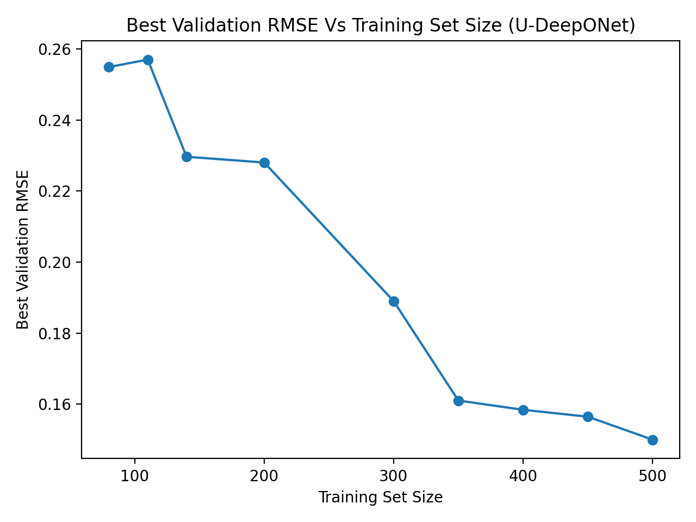

**Prediction accuracy across six heating configurations**
([`2D/02_u_deeponet/results/inference_metrics_prediction_cases.txt`](2D/02_u_deeponet/results/inference_metrics_prediction_cases.txt))

| Case | Heating configuration | Temperature MAE | Liquid-fraction MAE |
|---|---|---|---|
| 1 | Smooth Gaussian-process source | 1.73 K | 0.0248 |
| 2 | GP source + 1D Gaussian boundary profiles | 3.10 K | 0.0280 |
| 3 | Single prismatic battery source | 8.75 K | 0.0440 |
| 4 | Multiple prismatic battery sources | 3.32 K | 0.0351 |
| 5 | Generalised mixed-geometry sources | 2.75 K | 0.0369 |
| 6 | Generalised sources + 1D Gaussian boundary | 3.35 K | 0.0250 |

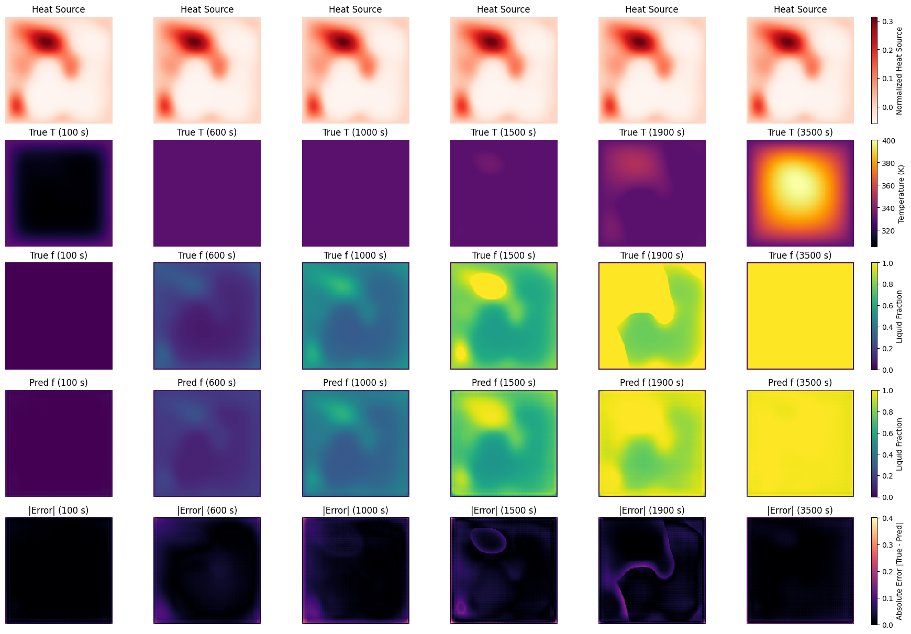

**Cross-geometry generalisation**
([`2D/05_cross_geometry_generalization/results/cross_geometry_inference_metrics.txt`](2D/05_cross_geometry_generalization/results/cross_geometry_inference_metrics.txt))

| Test geometry | Training data | Temperature MAE | Temperature R² | Liquid-fraction MAE | Liquid-fraction R² |
|---|---|---|---|---|---|
| Circular | prismatic only | 3.95 K | 0.9918 | 0.0283 | 0.9714 |
| Circular | generalised | **2.96 K** | **0.9952** | 0.0334 | 0.9598 |
| Elliptical | prismatic only | 3.48 K | 0.9927 | 0.0301 | 0.9659 |
| Elliptical | generalised | **2.82 K** | **0.9946** | 0.0365 | 0.9542 |

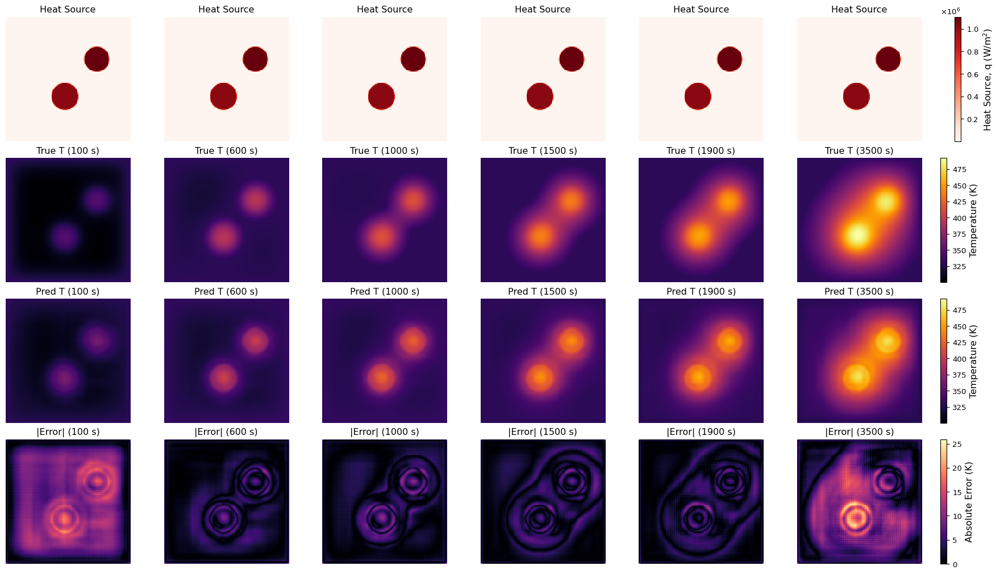

**Slice-based 3D prediction**

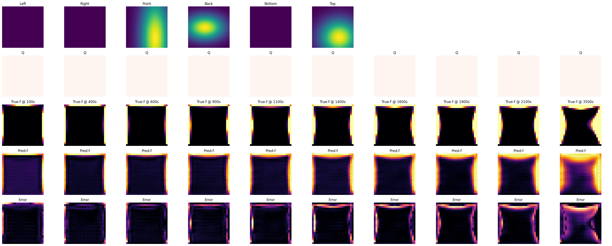

---

## Shared physical model and reference solver

Every dataset in this repository is produced by the same family of solvers: an **enthalpy-porosity**
formulation of melting in a PCM–metal-foam composite, integrated explicitly in time. The 2D code is
reproduced verbatim in [`common/physics/`](common/physics/); the full write-up is in
[`docs/methodology/physical_model_and_solver.md`](docs/methodology/physical_model_and_solver.md).

**Governing equations.** PCM infiltrated into open-cell metal foam is modelled with volume-averaged
effective properties rather than a resolved pore geometry:

```
H   = [C_p,pcm (1 − φ) + C_p,m φ] T  +  (1 − φ) f_l L
f_l = ( H − [C_p,pcm (1 − φ) + C_p,m φ] T_m ) / ( (1 − φ) L )
∂H/∂t = k_avg ∇²T + Q
```

**Solver.** Explicit FTCS on a uniform grid, time step set from the diffusive stability limit
`dt = CFL · min(dx², dy²)/(4α)`. Each step applies boundary conditions, computes the interior
Laplacian, advances enthalpy, and recovers `T` and `f` through the three-branch enthalpy update:

| Regime | Condition | Temperature | Liquid fraction |
|---|---|---|---|
| Solid | `f* ≤ 0` | `T = H / c_p` | `f = 0` |
| Mushy | `0 < f* < 1` | `T = T_m` | `f = f*` |
| Liquid | `f* ≥ 1` | `T = (H − L) / c_p` | `f = 1` |

This is what pins the temperature to `T_m` across the mushy zone and produces the sharp interface the
surrogates then have to reproduce — and it is why the dominant surrogate error is a *front-position*
error rather than a magnitude error.

Cells inside a battery are **excluded from melting**: `f` is pinned to 0 while `T` still evolves.

**Baseline properties:**

| Quantity | 2D | 3D |
|---|---|---|
| Grid | 120 × 120 (40 × 40 in stage 2a) | 24 × 24 × 24 |
| Domain | 0.05 m × 0.05 m | 0.05 m cube |
| `ρ`, `c_p`, `k`, `L` | 800 kg/m³, 2000 J/(kg·K), 0.2 W/(m·K), 2 × 10⁵ J/kg | same |
| `T_m`, `T_init`, `T_bound` | 330 K, 300 K, 330 K | same |
| `t_end`, CFL | 4000 s, 0.45 | 4000 s, 0.30 |
| Snapshots | 24 (9 in stage 2a) | 24 |

**Heat-source generation.** Three modes, sampled ≈ 1/3 each in the final dataset:

- **`gp`** — a smooth field from an RBF-kernel Gaussian process (length scale 0.18, σ = 1, scaled to
  `q_scale = 1e5` W/m³), optionally forced positive by a softplus and re-centred to a target mean;
- **`battery`** — 2–3 anti-aliased footprints (rectangle / rotated rectangle / circle / ellipse, equal
  probability) at `1.0–1.2 × 10⁶` W/m³ on a 4.5 W/m³ background, 6× supersampled, with 3 mm wall
  clearance and 2 mm inter-cell separation;
- **`hybrid`** — a weighted mix of the two.

**Boundary conditions.** Each wall is independently constant, a 1D Gaussian profile
`T(s) = base + amp · exp(−½((s − μL)/(σL))²)` with `μ ∈ [0.25, 0.8]`, `σ ∈ [0.12, 0.7]`,
`amp ∈ [12, 80]` K, or switched off (adiabatic). Deterministically seeded per case index, so any case
can be regenerated exactly.

---

# Stage detail

## Stage 1 — 1D pointwise DeepONet (feasibility)

> **Status of the code for this stage.** The 1D DeepONet is described in the BTech thesis
> (§3.3.1, §3.3.2, §4.3 and Chapter 5), and the figures it produced are preserved in
> [`1D_pointwise_deeponet/figures/`](1D_pointwise_deeponet/figures/). **The notebook that
> implemented it is not present anywhere in the source archive** from which this repository was
> reconstructed — the earliest surviving code (November 2025) is already the 2D pointwise pipeline.
> Everything below is documented from the thesis and from the surviving figures, not read off source
> code. See [`docs/repository_audit.md`](docs/repository_audit.md).

**Objective.** Establish, on the simplest possible problem, that a branch–trunk operator network can
represent the map from a *spatial heat-source function* to the resulting *temperature field* in a
diffusion-dominated system — before committing to transient, phase-changing, 2D physics.

**Problem.** A 1D domain `x ∈ [0, 1]` with temperature pinned to zero at both ends:

```
G : Q(x) ⟼ T(x),        T(0) = T(1) = 0
```

No phase change and no time dependence — the point is the operator, not the physics. This is the 1D
reduction of the energy equation with the transient and latent-heat terms dropped. Input functions come
from an RBF-kernel Gaussian process; the kernel length scale `l` and variance `σ` control how wiggly
the sampled functions are. The same generator, promoted to two dimensions, supplies the heat-source
fields for every later stage.

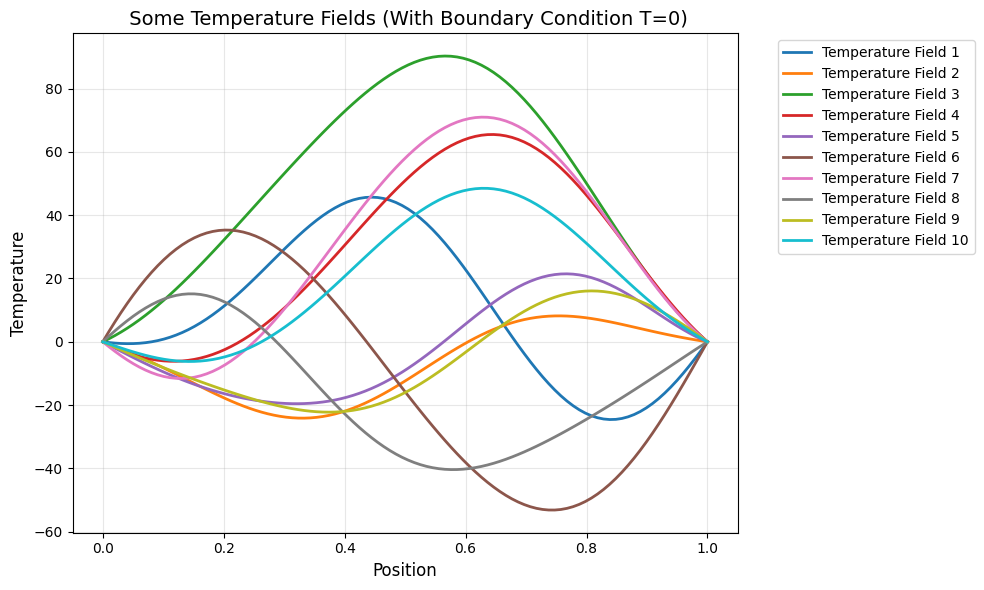

**Model and training.**

| | |
|---|---|
| Formulation | `T̂(x \| Q) = ⟨ branch(Q), trunk(x) ⟩ + b` |
| Branch | 2 hidden layers × 128 neurons, ReLU |
| Trunk | 2 hidden layers × 128 neurons, ReLU |
| Head | inner product + learned bias |
| Data | 500 source–temperature pairs |
| Optimiser | Adam, lr 1e-3, batch 512, 200 epochs, MSE |

**Results.** Training and validation loss both converge, with the validation curve tracking the
noisier per-iteration training curve throughout — no divergence, so no overfitting at this model size.

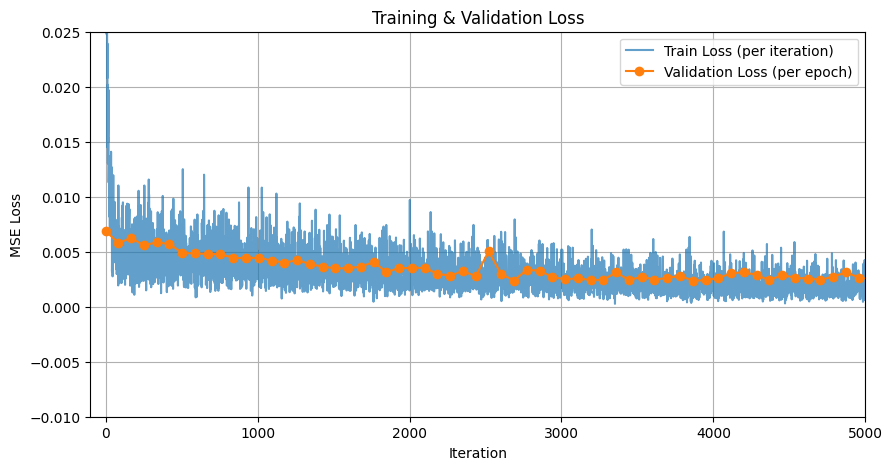

On held-out samples the prediction is visually indistinguishable from the reference over most of the
domain, with small deviations only near interior extrema. Note the range of input scales across the
four samples (`Q` spanning ±1500 in one case and ±0.6 in another): the operator handles both without
retraining, which is the property that made the 2D extension worth attempting.

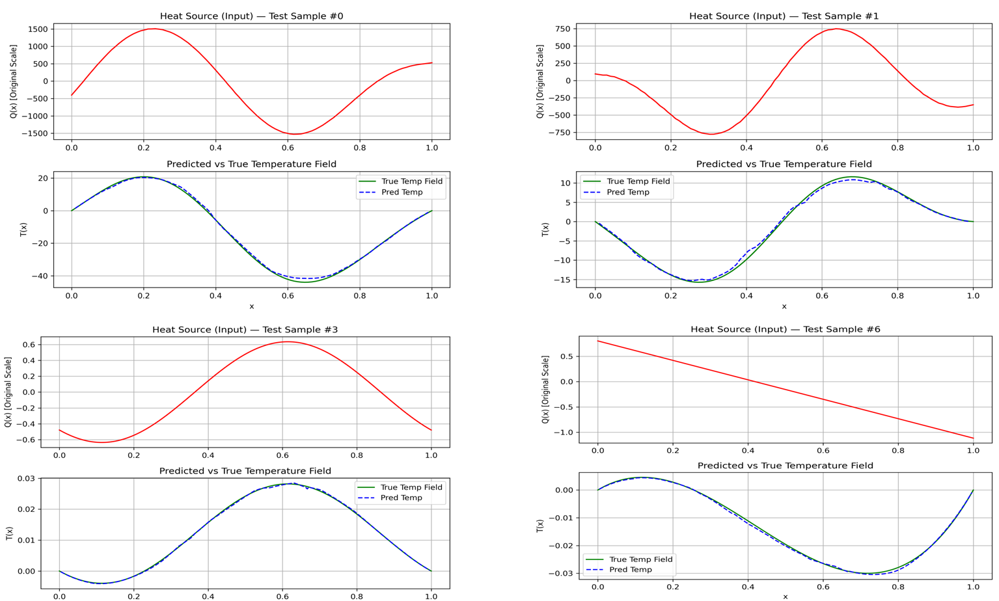

All three figures are reproduced from the BTech thesis report (Figs. 2a, 20 and 25a), because the
original image files could not be located in the archive.

**Reproduction.** The implementing code is absent, so this stage cannot be re-run from this repository.
Reconstructing it from the specification above is straightforward — sample 500 functions with the GP
generator in [`common/physics/heat_source_gp.py`](common/physics/heat_source_gp.py) restricted to one
dimension, solve the 1D steady conduction problem for each, and train the two-network DeepONet. Any
such reconstruction is a **re-implementation**, not the original, and should be labelled accordingly.

**Limitations.** Steady state only — no melting, no latent heat, no time coordinate; the trunk encodes
space alone, whereas every later stage must also encode time. One dimension also hides the problem that
dominates 2D and 3D: the spatial correlation structure of the field. A flattened MLP branch is
perfectly adequate at this scale, which is precisely why its failure modes only became visible in
stage 2a. The success of this stage is best read as a *go/no-go*.

---

## Stage 2a — 2D pointwise DeepONet

The first transient, phase-changing surrogate in the project, and the earliest surviving code in the
archive (November 2025).

**Objective.** Extend the 1D feasibility result to a genuinely transient 2D PCM–foam problem: learn
both the temperature field and the liquid-fraction field as functions of the heat source, the boundary
configuration, and the space–time query point.

```
T(x, y, t) = G_T( Q(x, y), BC ; x, y, t )
f(x, y, t) = G_f( Q(x, y), BC ; x, y, t )
```

**Dataset.**

| Property | Value |
|---|---|
| Grid | 40 × 40 |
| Time snapshots | 9 — `(100, 250, 400, 600, 1000, 1200, 1500, 1800, 2100)` s |
| Cases | 200 |
| Split | 80 % / 10 % / 10 %, case-wise, `default_rng(2024)` |
| Effective training points | 40 × 40 × 9 × 200 ≈ 2.88 × 10⁶ |
| Heat sources | RBF-GP fields, `q_scale = 1e5` W/m³ |
| Boundaries | top/bottom constant; left/right constant or 1D Gaussian, seeded per case |

[`code/data_generation/pointwise_dataset_generation_2d.ipynb`](2D/01_pointwise_deeponet/code/data_generation/pointwise_dataset_generation_2d.ipynb)
runs the solver and then **sensorises** the result into DeepONet form: `branch_Q` (heat-source field
flattened), `branch_BC` (wall profiles, down-sampled and concatenated across snapshots), `trunk_xy` and
`trunk_t` (query coordinates), and the target scalar.
[`pointwise_pipeline_all_in_one_2d.ipynb`](2D/01_pointwise_deeponet/code/pointwise_pipeline_all_in_one_2d.ipynb)
is the single-notebook version — the most complete surviving record of this stage's exploratory work.

**Architecture.** Four sub-networks, each producing a `D`-dimensional embedding, each LayerNormed,
fused through two parallel paths:

| Sub-network | Input | Hidden layers | Output |
|---|---|---|---|
| Q-branch | flattened `Q` | (256, 256, 256) | `D = 256` |
| BC-branch | boundary feature vector | (256, 256, 256) | `D = 256` |
| XY-trunk | `(x, y)` | (256, 256, 256, 256) | `D = 256` |
| T-trunk | `t` | (128, 128) | `D = 256` |
| Head | `[e_Q, e_BC, e_XY, e_t]` (4·D) | (256, 128) | 1 |

```
y_concat = Head([e_Q, e_BC, e_XY, e_t])                    # additive / expressive path
y_prod   = Σ (e_Q ⊙ e_BC ⊙ e_XY ⊙ e_t) / √D                # multiplicative path
ŷ = α_add · y_concat  +  α_prod · y_prod  +  b
```

`α_add` and `α_prod` are **learned** scalars initialised to 1.0 and 0.2. Activation GELU, dropout 0.3.

**Training.** Adam @ 1e-3, weight decay 1e-4, 60 epochs, 64 steps/epoch, 16,384 pooled points per
batch, MSE on normalised targets. Separate runs for `TARGET = "T"` and `"f"`; archived checkpoints are
`deeponet_temp_model_4net.pt` and `deeponet_frac_model_5net.pt`.

**Results.** Training MSE and RMSE both fall steeply in the first epochs and then improve slowly.
**The final temperature RMSE stabilises at 3–4 K**, physically meaningful given the ~300–600 K range
the fields span, and it validated the whole operator-learning approach for transient phase change.

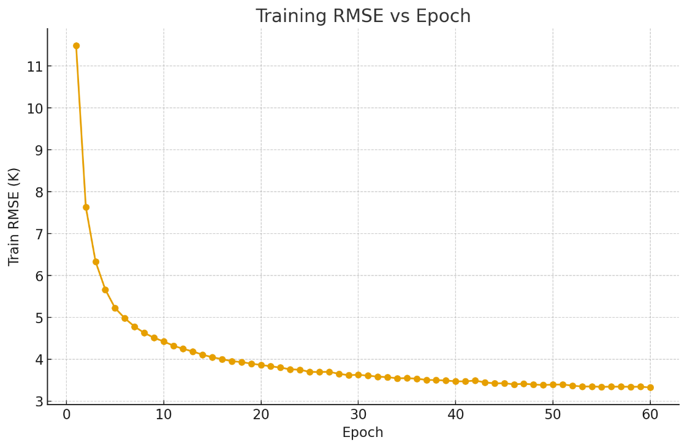
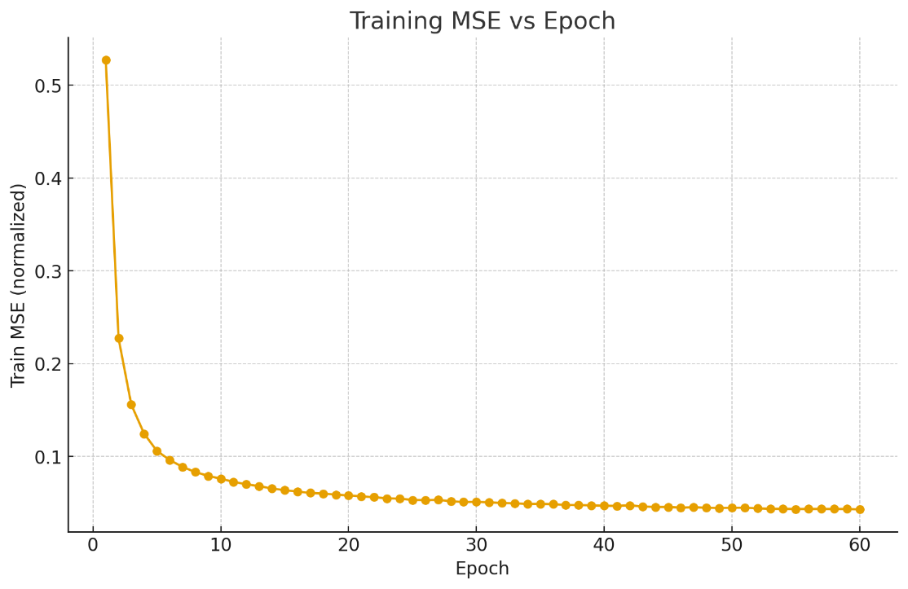

Reconstructed fields agree with the solver in both the location and the evolution of the melt front.
The limitation is visible rather than statistical: interfaces are smoother than the reference, and
inference is slow because the operator must be evaluated point by point.

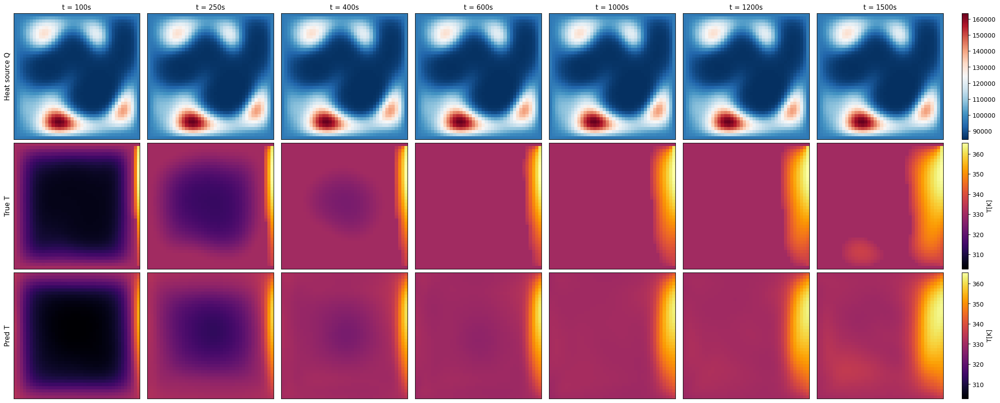

**Why this was abandoned** — the four observations that motivated stage 2b:

1. **Spatial structure is thrown away.** Flattening the field for a dense branch discards locality and
   translation invariance — the inductive bias a conduction problem most wants.
2. **Cost per unit information is high.** Millions of pooled points, large batches, many iterations per
   epoch, and the same spatial features relearned repeatedly.
3. **Melt fronts are smoothed.** Dense global transformations without hierarchical feature extraction
   blur the mushy zone; most obvious in the liquid-fraction predictions.
4. **Data-efficiency studies are impractical.** Retraining this model across nine dataset sizes was
   prohibitively slow.

---

## Stage 2b — 2D U-DeepONet (grid-to-grid operator learning)

The main two-dimensional result of the thesis, and the architecture everything afterwards builds on.

**Objective.** Replace pointwise sampling with grid-to-grid operator learning, so that one PCM
simulation is one structured training sample — and use the resulting cheap training to push the dataset
towards realistic, battery-shaped heat sources at higher resolution.

```
G : X_static [C_in, H, W]  ×  times [T]  ⟼  Y [T, H, W]
```

**Dataset.**

| Property | Value |
|---|---|
| Grid | 120 × 120 (no padding needed — 120 is a multiple of 8) |
| Time snapshots | 24 — `(100 … 2100 in 100 s steps, then 2500, 3000, 3500)` s |
| Cases | 500 |
| Split | 80 % / 10 % / 10 %, case-wise, `default_rng(2024)` |
| Input channels | 13 |
| Arrays | `X_static [C, 13, 120, 120]`, `Y_T`, `Y_f [C, 24, 120, 120]`, `times [24]` |
| Size on disk | ≈ 230 MB compressed |

The 13 input channels, in order:

```
[ Q, battery_mask, x, y,
  left_val, left_mask, right_val, right_mask,
  bottom_val, bottom_mask, top_val, top_mask,
  ones ]
```

Each wall contributes a *value* map (imposed temperature, broadcast inward) and a *mask* map (whether
that wall is active), which lets one model serve constant, Gaussian and adiabatic walls without
changing its input shape. The exact channel list and every battery-sampling range are recorded in
[`2D/02_u_deeponet/data/dataset_meta.json`](2D/02_u_deeponet/data/dataset_meta.json).

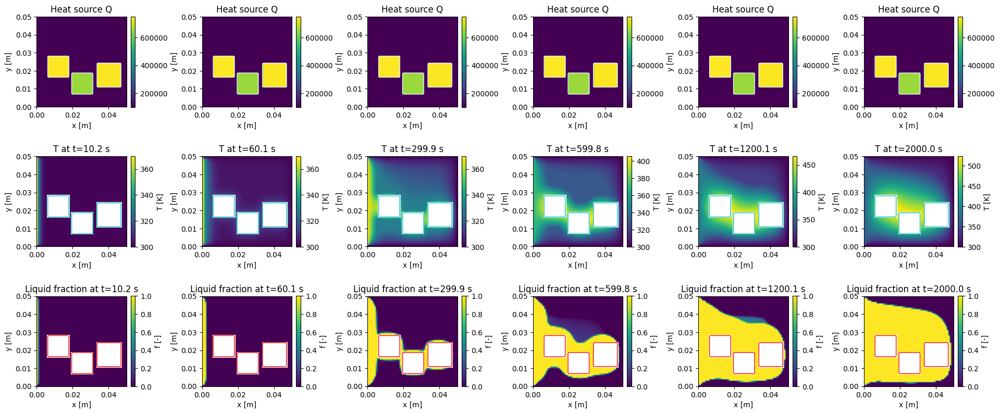
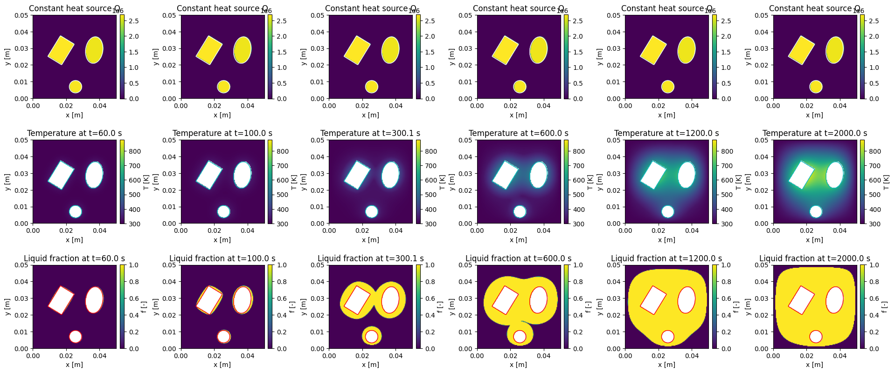

**Architecture.** U-Net block with constant channel width `f`, LeakyReLU(0.2), BatchNorm:

| Step | Operation | Stride |
|---|---|---|
| c1 | Conv 3×3, f→f | 2 |
| c2 | Conv 3×3, f→f | 2 |
| c3 | Conv 3×3, f→f | 1 |
| c4, c5 | Conv 3×3, f→f (bottleneck) | 2, 1 |
| u1 | ConvTranspose 4×4, f→f, concat c3 | 2 |
| u2 | ConvTranspose 4×4, 2f→f, concat c1 | 2 |
| u3 | ConvTranspose 4×4, 2f→f, concat input | 2 |
| out | Conv 3×3, 2f→f | 1 |

| Hyper-parameter | Value |
|---|---|
| Feature width `f` | 64 |
| U-Net blocks | 3 |
| Trunk hidden width / depth | 128 / 10 |
| Trunk activation | `sin` |
| Dropout | 0.0 |

The branch is *not* conditioned on time and the trunk is *not* conditioned on space: this separability
is precisely what lets one forward pass emit all 24 snapshots. The cost is that space–time couplings
which do not factorise cannot be represented — not limiting for diffusion-driven melting.

**Normalisation** uses training-split statistics only: inputs standardised per channel over
(case, H, W); targets standardised with a single scalar mean/std; times scaled by `t / max(t)`.

**Training.** Adam @ **1e-4**, weight decay 1e-4, 60 epochs, batch 16 cases, MSE on normalised fields,
best-validation checkpointing to `checkpoints_udeeponet_{T,f}/best.pt`. Iteration-level logs for the
500-case runs are in [`2D/02_u_deeponet/results/`](2D/02_u_deeponet/results/).
`udeeponet_temperature_2d_first_unet_prototype.ipynb` is the earliest surviving U-Net-branch
experiment, retained as the transition point between stages 2a and 2b.

**Results.** MAE over the full space–time field for the six heating configurations:

| Case | Heating configuration | Mean `Q` (W/m³) | T MAE | T RMSE | f MAE | f RMSE |
|---|---|---|---|---|---|---|
| 1 | Smooth GP source | 1.00 × 10⁵ | 1.73 K | 2.62 K | 0.0248 | 0.0444 |
| 2 | GP source + 1D Gaussian BCs | 1.00 × 10⁵ | 3.10 K | 4.32 K | 0.0280 | 0.0660 |
| 3 | Single prismatic source | 1.80 × 10⁵ | 8.75 K | 11.89 K | 0.0440 | 0.1456 |
| 4 | Multiple prismatic sources | 1.52 × 10⁵ | 3.32 K | 4.47 K | 0.0351 | 0.0959 |
| 5 | Generalised mixed-geometry sources | 1.16 × 10⁵ | 2.75 K | 4.04 K | 0.0369 | 0.1041 |
| 6 | Generalised sources + 1D Gaussian BC | 1.62 × 10⁵ | 3.35 K | 4.51 K | 0.0250 | 0.0680 |

**Inference cost: 0.069–0.300 s** per case for all snapshots at once.

Two things are worth reading off this table. First, accuracy is worst for the **single prismatic
source** (Case 3) — a lone concentrated block produces the steepest gradient and the sharpest melt
front. Second, the *maximum* error is always concentrated on the interface while the mean stays small:
the residual maps show a thin bright ring on the melt front and near-black elsewhere. That is the
characteristic error signature of this model, and it is a front-position error rather than a
field-magnitude error.

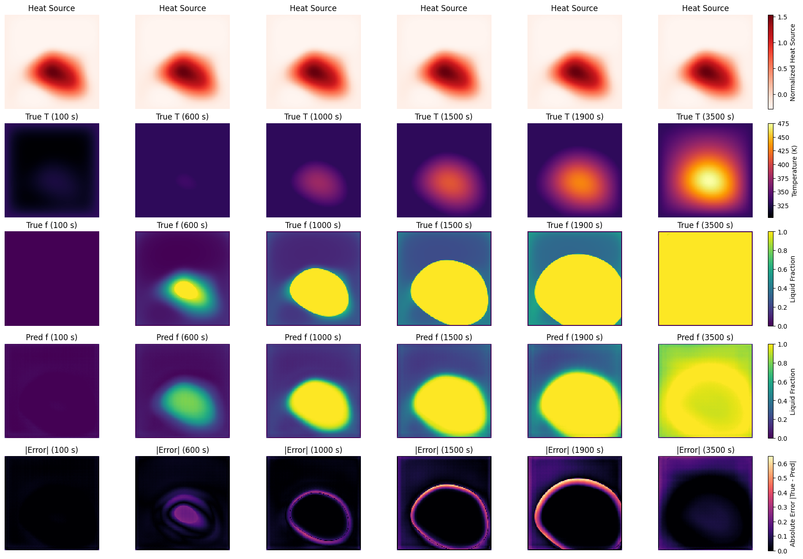
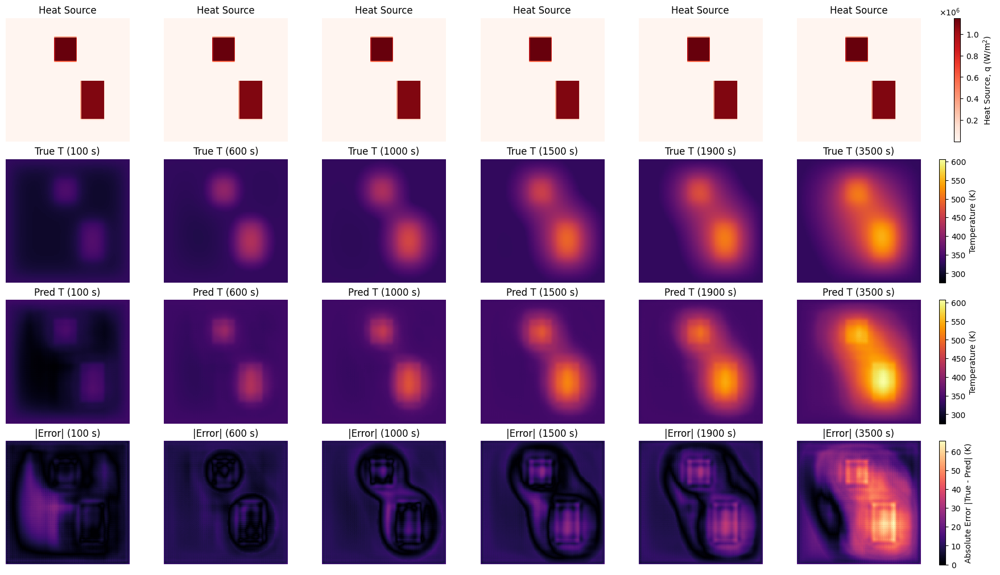

**Limitations.** A mild smoothing near sharp interfaces remains, inherited from the convolutional
decoder — much reduced relative to the pointwise model but not eliminated, and it is the dominant error
mode. Single concentrated sources are the hardest case. Boundary information is encoded as value + mask
channels, which works but means the model sees wall temperature as an image rather than as a
functional; a dedicated boundary branch might generalise better to wall profiles far outside the
sampled family. All archived training was on CPU.

---

## Stage 2c — Data-sensitivity study

**How many high-fidelity simulations does the U-DeepONet actually need?**

The expensive part of a surrogate is not the network — it is the training data. Each PCM case requires
a full transient enthalpy-porosity solve. This study was only practical *because of* the grid-to-grid
redesign: with the pointwise DeepONet, retraining nine times over was prohibitively slow.

**Method.** Nine training-set sizes — 80, 110, 140, 200, 300, 350, 400, 450, 500 cases — each trained
independently for 60 epochs under **identical hyper-parameters**. Target is the **liquid fraction**, the
harder of the two fields. Metrics are RMSE on normalised data.

| Training cases | Best validation RMSE | Best epoch | Best validation loss | Train RMSE at that epoch |
|---:|---:|---:|---:|---:|
| 80 | 0.25497 | 58 | 0.065010 | 0.32095 |
| 110 | 0.25706 | 51 | 0.066078 | 0.26487 |
| 140 | 0.22968 | 58 | 0.052753 | 0.25826 |
| 200 | 0.22806 | 57 | 0.052091 | 0.24205 |
| 300 | 0.18900 | 59 | 0.035748 | 0.16988 |
| 350 | 0.16098 | 59 | 0.026107 | 0.17282 |
| 400 | 0.15838 | 60 | 0.025263 | 0.17157 |
| 450 | 0.15643 | 58 | 0.024497 | 0.17547 |
| 500 | 0.14997 | 57 | 0.022772 | 0.16321 |

**Three regimes.**

*Low-data (80–140)* — RMSE stays above 0.23, performance oscillates, and the model underfits. At 80
cases the *training* RMSE (0.321) is worse than the validation RMSE (0.255) — the signature of a model
that has not yet learned the global structure, not one that is overfitting.

*Moderate-data (200–300)* — a clear break. RMSE drops below 0.20 and convergence becomes stable. Enough
diversity has entered the operator-learning problem for the spatial patterns to be learned properly.

*High-data (350–500)* — improvement continues with diminishing returns. From 400 to 500 cases RMSE
falls only from 0.1584 to 0.1500, under 6 %. Performance is saturating against the capacity of this
architecture, not against the data.

Across all nine runs training and validation curves stay close and the best epoch is consistently in
the high 50s, so nothing is overfitting — the limit is model capacity and data diversity.

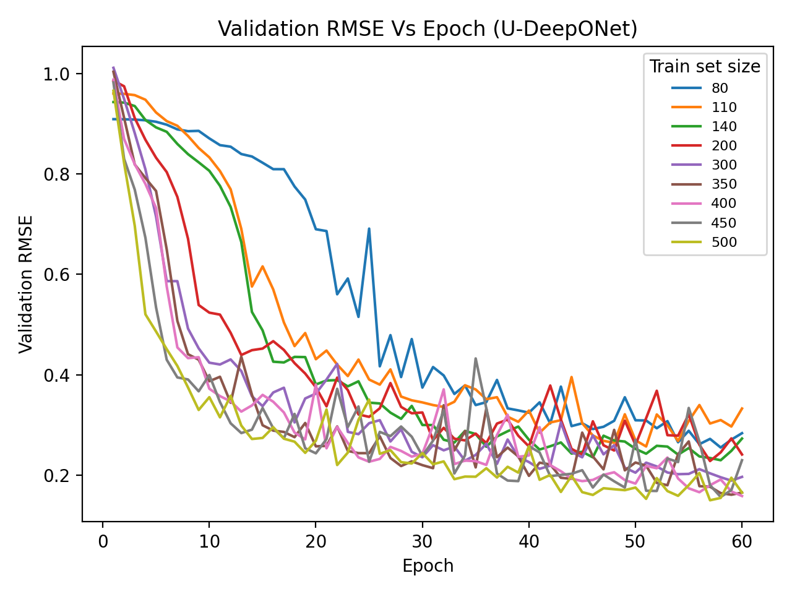
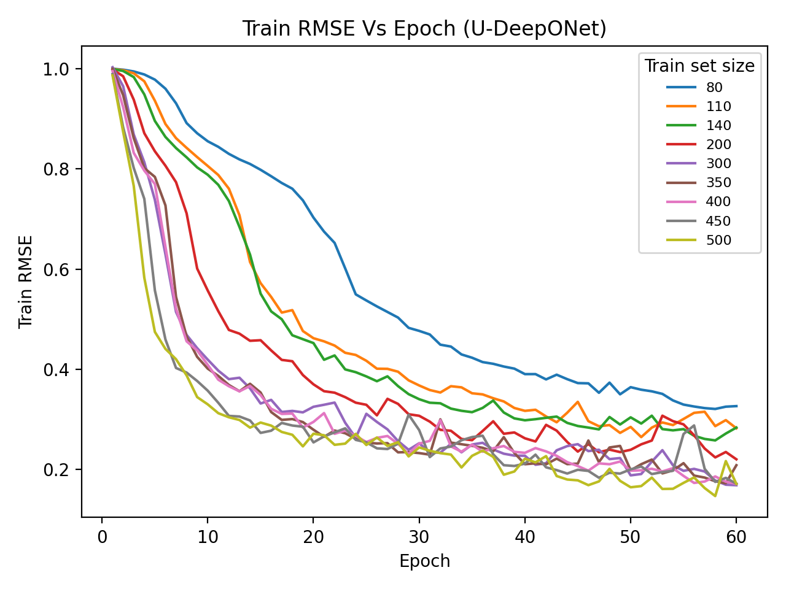

**Practical reading.** Around **300–400 simulations** buys most of the achievable accuracy for this
architecture. Going beyond 500 would be better spent on model capacity, on a loss term that penalises
interface displacement, or on broadening the *kind* of cases rather than their number.

**Reproduction.** There is no separate notebook — it is the stage-2b liquid-fraction training notebook
run nine times, restricting the training split to the first *n* cases while keeping validation fixed,
with the per-epoch logs collected. Full epoch-by-epoch data is in
[`2D/03_data_sensitivity/results/`](2D/03_data_sensitivity/results/).

**Limitations.** Single seed per size — differences between adjacent sizes (400 vs 450) are within
plausible run-to-run variance, so the *trend* is the trustworthy result. Liquid-fraction target only.
Normalised RMSE is not directly interpretable in kelvin or melt fraction.

---

## Stage 2d — Boundary and physics parameter studies

Two kinds of material: **reference-solver studies** that isolate individual physical drivers (so the
dataset is understood before it is learned), and a **U-DeepONet variant** trained on cases that include
prescribed boundary temperature profiles.

**Study A — volumetric heating intensity.** The source is scaled to four magnitudes with the boundary
held at a constant 330 K, so the only difference between runs is how hard the interior is heated:
5 × 10⁴, 8 × 10⁴, 1 × 10⁵ and 3 × 10⁵ W/m³. Each figure shows temperature and liquid fraction at the
saved snapshots for the same heat-source realisation, so they can be read side by side. `1 × 10⁵` W/m³
is the value adopted as `q_scale` for the main datasets.

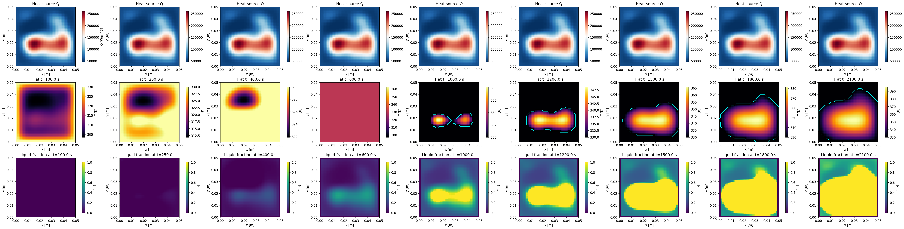

**Study B — boundary-driven melting only.** The volumetric source is removed and walls are held at
350 K, above the 330 K melting point, so melting is driven purely from the boundary inward — constant
on all sides, and a 1D Gaussian on a varied side. These produce the **opposite melt topology** to
Study A: the front moves inward from the walls rather than outward from hot spots. Having both in the
training distribution is what allows a single surrogate to cover the range from battery-dominated to
wall-dominated thermal management.

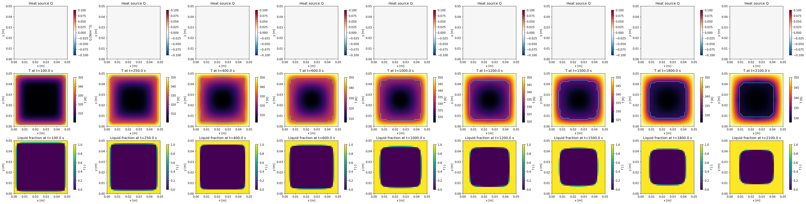

**Study C — U-DeepONet with prescribed boundary profiles.** Architecture and hyper-parameters unchanged
from stage 2b — only the dataset differs, which is what makes the comparison meaningful. Notebook:
[`2D/04_boundary_and_physics_studies/code/`](2D/04_boundary_and_physics_studies/code/). The
quantitative result is already in the case table: Case 2 (GP + 1D Gaussian boundary) and Case 6
(generalised + 1D Gaussian boundary) reach temperature MAEs of 3.10 K and 3.35 K, comparable to the
no-boundary-heating cases — the surrogate handles superimposed boundary heating without a separate
model.

**Reproduction.** Studies A and B are reference-solver runs: run the stage-2b dataset generator with
`q_scale` set to each of 5e4/8e4/1e5/3e5 and `T_bound = 330` (Study A), or with the heat source zeroed,
`T_bound = 350` and `All_side_const_temp_boundary` toggled (Study B). Study C follows the standard flow
with `only_lr_vary = True` and `All_side_const_temp_boundary = False`.

**Observations.** Melt-front topology is governed by *which* driver dominates, not by magnitude alone.
The intensity sweep spans a factor of six in `q_scale`, and the resulting fields differ enough that a
surrogate trained at one intensity should not be assumed to transfer to another without checking. These
are single-case illustrations, chosen for legibility, not statistical summaries.

---

## Stage 2e — Cross-geometry generalisation

**Does an operator trained on rectangular battery cells work on circular and elliptical ones it has
never seen?** A surrogate that only works for the exact cell shape it was trained on is a curve fit,
not an operator.

**Design.** Two models, identical except for their training data — **prismatic-only** (the 500-case
dataset restricted to rectangular footprints) and **generalised** (mixing rectangular,
rotated-rectangular, circular and elliptical, equal shape probabilities). Both are evaluated on two
held-out test datasets built from geometries absent from the prismatic-only training data. Everything
else is fixed: `f = 64`, 10-layer sinusoidal trunk, Adam @ 1e-4, batch 16, 60 epochs. Within each
notebook, one cell evaluates the generalised model and the next evaluates the prismatic-only model on
the same test cases.

**Temperature.**

| Test geometry | Training data | MAE | RMSE | Max error | R² | Inference |
|---|---|---:|---:|---:|---:|---:|
| Circular | prismatic only | 3.95 K | 5.30 K | 30.49 K | 0.9918 | 0.072 s |
| Circular | generalised | **2.96 K** | **4.06 K** | **18.83 K** | **0.9952** | 0.072 s |
| Elliptical | prismatic only | 3.48 K | 4.62 K | 24.68 K | 0.9927 | 0.223 s |
| Elliptical | generalised | **2.82 K** | **3.97 K** | **21.73 K** | **0.9946** | 0.073 s |

**Liquid fraction.**

| Test geometry | Training data | MAE | RMSE | Max error | R² |
|---|---|---:|---:|---:|---:|
| Circular | prismatic only | **0.0283** | **0.0837** | 0.9278 | **0.9714** |
| Circular | generalised | 0.0334 | 0.0992 | 1.0000 | 0.9598 |
| Elliptical | prismatic only | **0.0301** | **0.0914** | 1.0000 | **0.9659** |
| Elliptical | generalised | 0.0365 | 0.1060 | 0.9994 | 0.9542 |

**Interpretation.**

*The prismatic-only model already transfers.* R² of 0.992–0.993 on temperature for geometries it never
saw is the headline result: the operator has learned diffusion and phase change from a heat-source
*field*, not a lookup of rectangle positions. The input representation helps — the source enters as a
continuous `Q` channel plus a mask, so a circle is simply a different field, not a different problem
class.

*Diversifying the training data helps temperature further.* Mixed geometries cut temperature MAE by
25 % on circular sources (3.95 → 2.96 K) and 19 % on elliptical (3.48 → 2.82 K), and nearly halve the
maximum error on circular sources (30.5 → 18.8 K). The largest errors are where a curved front must be
placed precisely, and that is exactly what curved training examples teach.

*Liquid fraction goes the other way, slightly.* On the `f` target the prismatic-only model scores
marginally **better** (MAE 0.0283 vs 0.0334 on circular). Stated plainly rather than glossed: with a
fixed capacity budget and the same 60 epochs, spreading the training distribution over four shape
families appears to cost a little sharpness on the binary-like liquid-fraction field, where accuracy is
dominated by getting a single contour in the right place. The maximum liquid-fraction error reaches
~1.0 in every configuration, meaning the front is locally displaced by at least one cell somewhere in
the domain — consistent with the interface-displacement error mode seen throughout stage 2b.

The practical conclusion is that **temperature and liquid fraction want different training mixes**, and
that if only one model can be trained, the generalised dataset is the safer choice because its worst
case is far better bounded.


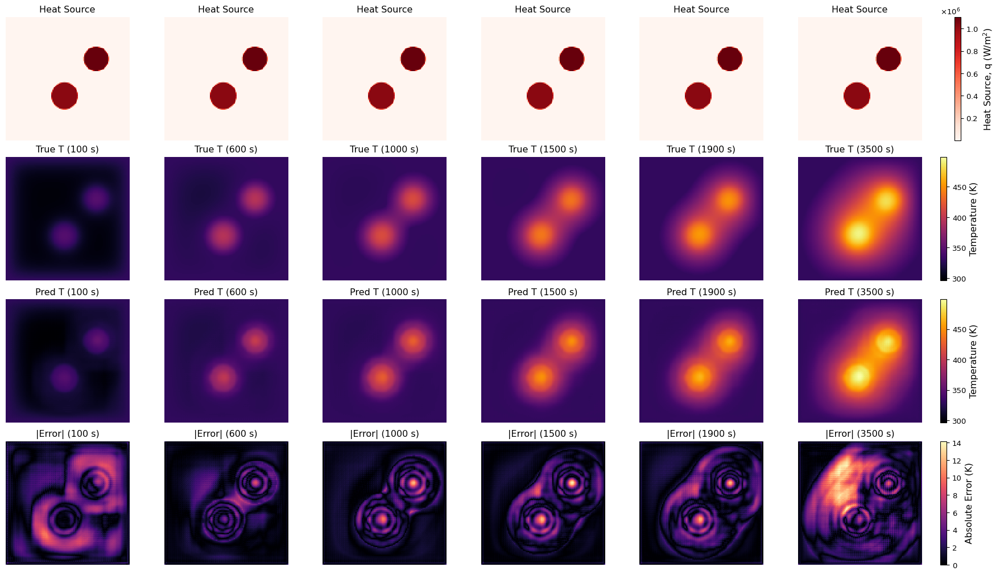

The circular pairs are matched case for case, so the two error-map rows can be compared panel by panel.

**Reproduction.** Generate three datasets (prismatic-only training, generalised training, and the
circular/elliptical test sets) by setting `BAT_SHAPE_PROBS` accordingly; train the temperature model on
each; then run the two notebooks in
[`2D/05_cross_geometry_generalization/code/`](2D/05_cross_geometry_generalization/code/). Note
that normalisation statistics must come from the *training* dataset of the model under test — the
notebooks do this explicitly via `load_train_norm(TRAIN_NPZ, ...)`, and getting it wrong silently
corrupts the comparison.

**Limitations.** Single run per configuration; the temperature differences are large enough to be
convincing, but the liquid-fraction reversal is small and would benefit from repeated seeds. The unseen
geometries are still drawn from the same generator family (anti-aliased convex footprints at comparable
magnitudes) — genuinely out-of-distribution sources such as cylindrical cell arrays, pouch cells or
non-convex packs remain untested. The 0.223 s inference time is an outlier against the ~0.07 s norm and
most likely reflects a first-call warm-up.

---

## Stage 3 — Slice-based 3D U-DeepONet

Three-dimensional transient melting around an embedded prismatic battery, learned without ever running
a 3D convolution.

**Objective.** Real PCM modules are three-dimensional: heat leaves a battery in all directions, corner
and side-wall effects matter, and melt fronts advance anisotropically. The objective is a 3D surrogate
that captures this while remaining trainable on modest hardware — which rules out Conv3D over
`[N_t, N_x, N_y, N_z]` tensors.

```
G : ( Q(x,y,z), battery geometry, 6 boundary face fields ) ⟼ ( T(x,y,z,t), f(x,y,z,t) )
```

**Physical formulation.** The same enthalpy-porosity model extended to 3D, with the battery treated
explicitly rather than as a bare source term. Three battery modes are supported:

- **`lumped`** (used for the dataset) — battery temperature follows a lumped energy balance; net
  conduction from the battery surface is computed from the *same* temperature field used in the
  Laplacian, so what the battery loses is exactly what the PCM gains;
- **`dirichlet`** — battery held at a fixed temperature;
- **`solid_2d`** — phase fraction pinned, temperature evolves from enthalpy.

| Quantity | Value |
|---|---|
| Grid / domain | 24³ / 0.05 m cube |
| `t_end`, CFL | 4000 s, 0.30 |
| Battery heat generation | 8 × 10⁵ – 1.4 × 10⁶ W/m³ |
| Battery edge lengths | 0.010 – 0.018 m |
| Wall clearance | ≥ 0.006 m |
| PCM background source | 4.5 W/m³ |
| Batteries per case | 1 |

Each of the six faces carries a full 2D temperature field — constant, 1D Gaussian along either in-plane
axis, or a 2D Gaussian surface — with `μ ≤ 0.8`, `σ ≤ 0.7`, amplitude ≤ 80 K.

**The slice-based idea.** Storing and convolving `[N_t, N_x, N_y, N_z]` is the bottleneck: moving from
40×40 to 40×40×40 is 40× more points per snapshot, and Conv3D multiplies both parameter count and
memory on every layer. Instead each 3D case is decomposed into stacks of 2D slices:

```
volume  ──▶  15 x-normal slices (yz images)
             15 y-normal slices (xz images)
             15 z-normal slices (xy images)
```

Every slice is stored as an **18-channel image**:

```
Q  +  3 coordinate maps  +  6 boundary-face value maps  +  6 boundary-distance maps
   +  battery mask  +  ones
```

The six *distance* channels are what make a 2D slice aware of its 3D context: they tell the network how
far the slice sits from each face, so a mid-plane slice and a near-wall slice are distinguishable even
though both are just images. Slice positions are sampled uniformly inside the domain. One shared 2D
network serves all three orientations with an axis identifier — hence *unified* slice model.

**Dataset.**

| Property | Value |
|---|---|
| Cases | 500 |
| Time snapshots | 24 |
| Slices per axis | 15 (45 static slice inputs per case) |
| Input / target channels | 18 / 2 (`T_slice`, `f_slice`) |
| Arrays | `Xstatic_{x,y,z} [C, 15, 18, H, W]`, `Y_{x,y,z} [C, 15, 24, 2, H, W]` |
| Size on disk | 0.3 – 1.7 GB depending on how many full 3D fields are also saved |

**Model.**

```
for each slice j in a 13-slice window centred on the target slice:
      X_j [18, H, W] ──1×1 lift──▶ 64 ch ──UNet──act──UNet──act──UNet──▶ feat_j   (shared weights)

slice fusion :  concat(feat_j) [13·64, H, W] ──1×1 Conv + BN + act──▶ feat [64, H, W]
time branch  :  t ──Fourier features (1 + 2·8 dims)── MLP(→64→64) ──▶ t_emb [64]
fusion       :  concat(feat over T, t_emb over H,W) [128, H, W]
                ──Conv3×3+BN+act──Conv3×3+BN+act──Conv1×1──▶ ŷ [T, H, W]
```

| Hyper-parameter | Value |
|---|---|
| Window size | 13 slices (radius 6, reflected/clamped at stack edges) |
| U-Net base width / blocks | 64 / 3 |
| Time embedding dim | 64 |
| Fourier frequencies | 8 (`ω_k = 2^k · π`) |
| Activation / dropout | `sin` / 0.0 |

Three differences from the 2D model matter. The **13-slice window** replaces a single input plane, so
the network sees out-of-plane structure — this is what recovers the third dimension slicing throws away.
The time branch uses **Fourier features** rather than a plain trunk, giving a sharper handle on the
rapid early transient. And fusion is **convolutional** rather than an outer product, which is strictly
more expressive at the cost of a forward pass per time step.

**Training.**

| Setting | Value |
|---|---|
| Optimiser | Adam @ 1e-3, weight decay 1e-4 |
| Epochs / batch | 60 configured / 128 slice samples |
| Base loss | MSE on normalised fields |
| Temporal smoothness weight | 1e-4 |
| Gradient-matching weight | 0.15 |
| Interface weight (`f` only) | 0.2, Gaussian around `f = 0.5`, σ = 0.15, α = 2.0 |

The **interface-weighted loss** is specific to the liquid-fraction target and directly addresses the
dominant error mode of the 2D model: it up-weights cells near `f = 0.5`, where the melt front is, so
the optimiser spends capacity on front placement rather than on the large easy regions of fully solid
or fully liquid PCM.

**Results** (from [`3D/results/`](3D/results/), 500 cases, window 13, batch 128, lr 1e-3):

| Epoch | Train RMSE (norm.) | Val RMSE (norm.) | Val RMSE (physical) | Epoch time |
|---:|---:|---:|---:|---:|
| 1 | 0.5106 | 0.3705 | 0.1546 | 1045 s |
| 10 | 0.1529 | 0.1725 | 0.0720 | 1039 s |
| 28 (best) | 0.1120 | **0.1284** | **0.0536** | 2978 s |
| 34 | 0.1115 | 0.1799 | 0.0751 | 3896 s |

Validation RMSE falls from **0.370 to 0.128** normalised (**0.155 to 0.054** physical), with train and
validation curves staying close throughout. The oscillations are expected given the non-linear temporal
phase-change behaviour and the diversity of heating configurations.

Qualitatively, predicted slices track the reference fields across **all three orientations** and all
plotted snapshots. In the figures below the top row shows the six imposed face fields, then `Q`, then
reference `f`, predicted `f`, and absolute error, at ten snapshots. Error again concentrates on the melt
front and near the faces where the boundary Gaussians are strongest.


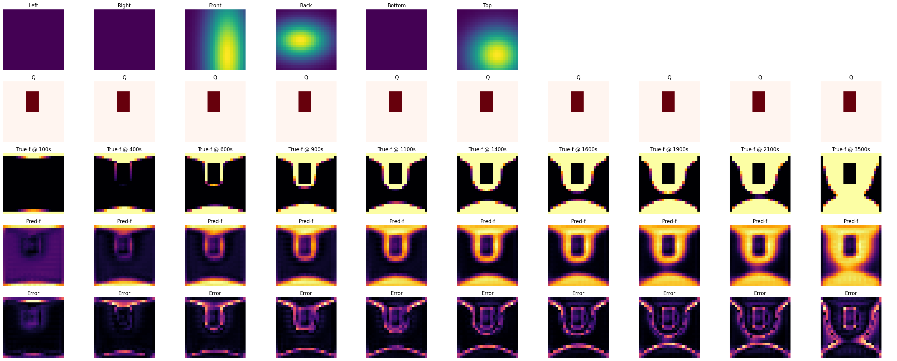

Animations reconstructed from the volumetric fields — `animation_3d_surface.gif` (melting-front
iso-surface) and `animation_3d_{x,y,z}mid.gif` (mid-plane slices) — are in
[`3D/figures/`](3D/figures/).

**Limitations.** The logged liquid-fraction run reaches **epoch 34 of 60**, with the best checkpoint at
epoch 28; the reported numbers come from that run, not a completed schedule. Slicing is an
approximation — out-of-plane structure is recovered through the window and the distance channels rather
than modelled directly, so correlations beyond the window radius are not represented. The grid is coarse
(24³ against 120² in 2D), so the visible pixelation in the slice figures is the grid, not the model.
One battery per case; multi-cell 3D packs, the real engineering configuration, are not covered. Epoch
time grows from 1045 s to 3896 s through the run, which points at resource contention on the training
machine rather than anything in the model.

---

## Repository structure

```
DeepONet-BTech-Thesis-GitHub/
├── README.md                     this file — the complete record
├── LICENSE                       all rights reserved pending publication
├── .gitignore
│
├── 1D_pointwise_deeponet/
│   └── figures/                  3 figures (code not in the source archive — see Stage 1)
│
├── 2D/
│   ├── 01_pointwise_deeponet/    code/{data_generation,training}/ + figures/
│   ├── 02_u_deeponet/            code/{data_generation,training,evaluation}/
│   │                             data/ (metadata + splits) · results/ (logs, metrics)
│   │                             figures/{dataset,predictions}/
│   ├── 03_data_sensitivity/      results/ (2 CSVs) + figures/
│   ├── 04_boundary_and_physics_studies/   code/ + figures/
│   └── 05_cross_geometry_generalization/  code/ + results/ + figures/
│
├── 3D/                        code/{data_generation,training}/ · data/ · results/ · figures/
│
├── common/physics/               heat_source_gp.py, enthalpy_solver_2d.py
│                                 verbatim extractions, for reading in one place
│
├── docs/
│   ├── methodology/physical_model_and_solver.md
│   ├── methodology/deeponet_architectures.md
│   ├── experiments/experiment_index.md      E1–E14, question → code → data → figure
│   ├── figure_index.csv                     every figure: path, description, origin
│   └── repository_audit.md                  how this repo was reconstructed; issues to verify
│
└── environment/                  requirements.txt, environment.yml
```

`common/physics/*.py` are **verbatim extractions** of notebook cells, provided as a readable reference
copy. The notebooks remain self-contained and do not import them, so the two cannot silently diverge in
behaviour — but if you edit the notebook cells, the reference copy needs updating by hand.

## Datasets and checkpoints (not included)

Neither datasets nor model checkpoints are in this repository. A single 2D run produces ≈ 230 MB and a
3D run 0.3–1.7 GB; checkpoints run 20–36 MB. Git LFS was considered and rejected — the checkpoints are
only meaningful alongside their datasets, so storing them alone would not make any result reproducible.
Everything is regenerable from the notebooks, which contain the complete solver and the exact
parameters used.

What *is* kept, per stage, under `data/`:

| File | Contents |
|---|---|
| `dataset_meta.json` | grid, domain, padding, channel count, the ordered channel list, time snapshots, heat-source mode probabilities, and every battery-sampling range |
| `dataset_splits.json` | the exact case indices for train / validation / test, seeded with `default_rng(2024)` |
| `case_statistics.csv` | per-case summary statistics of the reference solution |

Together these are enough to verify that a regenerated dataset matches the one used for the reported
results, and to reproduce the same splits.

A dataset-generation run writes:

```
dataset_run_YYYYMMDD-HHMMSS/
    udeeponet_dataset.npz  /  slice_dataset_3d.npz
    meta.json            compare against data/dataset_meta.json
    splits.json          compare against data/dataset_splits.json
    cases_bc.json        per-case boundary configuration
    case_meta.json       per-case heat-source mode and battery placements
    case_stats.csv/.jsonl
    case_*.png           per-case diagnostic plots
```

## Reproducibility

1. **Set up the environment** — `pip install -r environment/requirements.txt`
   (or `conda env create -f environment/environment.yml`).
2. **Generate a dataset** — run the `code/data_generation/` notebook of the stage you want.
3. **Move or symlink the resulting folder to `runs/`** next to the notebook. Machine-specific absolute
   paths from the original archive (`C:\Users\...`, `D:\BTP work\...`, `F:\BTP work\...`) were rewritten
   to repository-relative `runs/...` paths; the training notebooks otherwise auto-discover the most
   recent `dataset_run_*` directory in their working directory.
4. **Train** — run the `code/training/` notebook. Checkpoints go to
   `runs/<dataset_run>/checkpoints_udeeponet_{T,f}` (2D) or `checkpoints_unified_slice_unet_{T,f}` (3D),
   saving the best validation loss.
5. **Evaluate and plot** — the inference cells at the end of each training notebook, and the
   `code/evaluation/` notebook for the 2D case studies, reproduce the figures in `figures/`.

Run times from the archived logs: ≈ 8 s/epoch for the 2D liquid-fraction model at 400 cases, and
1000–3900 s/epoch for the 3D slice model (CPU; all archived logs report `DEVICE: cpu`). A GPU is
effectively required to repeat the 3D run in reasonable time. Budget ~250 MB of disk for a 2D run and
up to 1.7 GB for a 3D run.

**Exact numerical reproduction of the reported metrics is not guaranteed.** The datasets were seeded
(`default_rng(2024)` for splits and mode selection, `10_000 + i` per case for boundaries), but the
original checkpoints are not included, so training must be repeated and will land at a different local
optimum. Expect the trends and approximate magnitudes to reproduce, not the exact digits.

## Environment

Python 3.12 (notebook kernels in the archive record 3.12.0, 3.12.7 and 3.14.3), PyTorch **2.5.1+cu121**
as recorded in the archived notebook outputs, plus NumPy, SciPy, pandas, Matplotlib, scikit-learn,
scikit-image and joblib. The notebooks select CUDA when available and fall back to CPU; every archived
run was executed on CPU. See [`environment/`](environment/).

## Research status

This is **BTech thesis research** (IIT Bhubaneswar, 2025–2026), submitted in May 2026. It is **not
published**. A journal manuscript derived from parts of this work is in preparation; neither the
manuscript nor any of its source files are contained in this repository, and nothing here should be
read as a publication claim. The `LICENSE` reserves all rights pending publication — keep this
repository private until then.

[`docs/repository_audit.md`](docs/repository_audit.md) documents the full provenance of every artefact,
the decisions taken while curating this repository from the working archive, and **eleven items worth
verifying manually** — including a stale cell comment whose figures do not match its label,
configuration constants that differ between dataset-generation and training notebooks, and the fact
that every result here is single-seed.

### References underpinning the method

- Lu, Jin, Pang, Zhang & Karniadakis (2021), *Learning nonlinear operators via DeepONet*, Nature Machine Intelligence 3, 218–229.
- Diab & Al-Kobaisi (2024), *U-DeepONet* — the U-Net-branch grid-to-grid operator architecture adopted here.
- Ronneberger, Fischer & Brox (2015), *U-Net: convolutional networks for biomedical image segmentation*.
- Dinesh & Bhattacharya (2019), *Effect of foam geometry on heat absorption characteristics of PCM–metal foam composite thermal energy storage systems*, Int. J. Heat Mass Transfer 134, 866–883.
